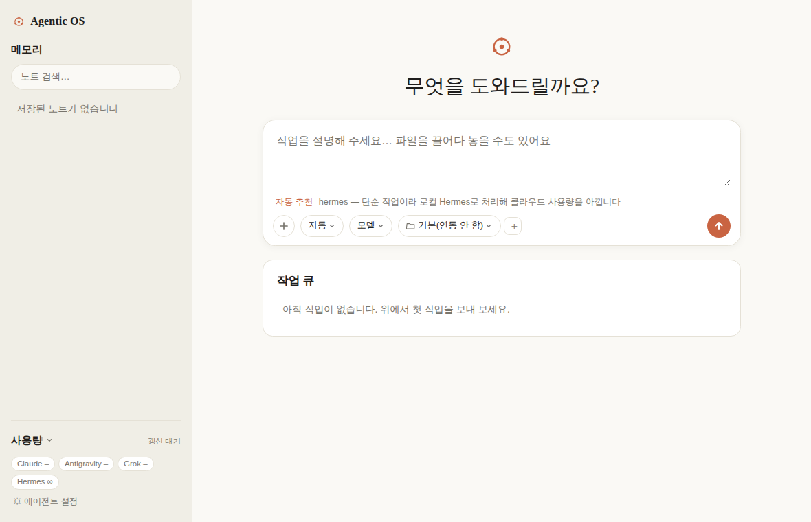
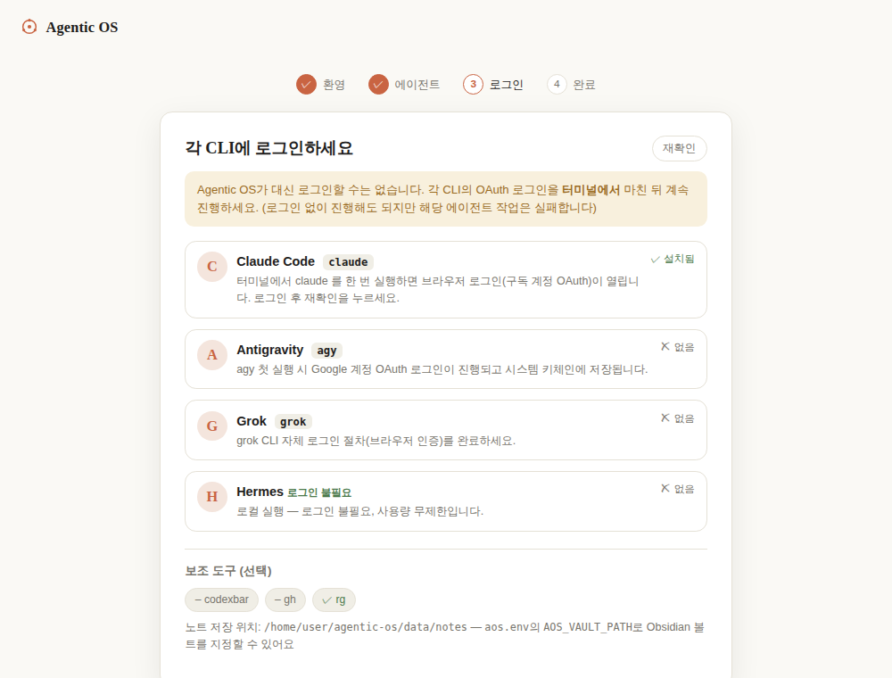

# Agentic OS

[](https://github.com/elec100-design/agentic-os/actions/workflows/ci.yml)
[](LICENSE)

> [한국어 README](README.ko.md)

**One local dashboard for all your paid AI CLIs** — routes work by real
remaining quota, queues it through rate limits, and files results into notes.
No API keys, no subscriptions to a hosted service: it drives the CLIs you
already pay for (Claude Code, Antigravity, SuperGrok, Hermes) in headless
mode and runs entirely on `localhost`.

- **Not another chat UI.** Claude Desktop and Grok are single-provider chat
  products. Agentic OS is an orchestrator that sits on top of the CLIs you
  already have, and automatically picks whichever one has the most quota
  left for the job.
- **Zero extra cost.** It never touches an API key — it shells out to your
  authenticated CLI's headless flag (`claude -p`, `agy -p`, `grok -p`,
  `hermes -z`), so usage counts against your existing subscription.
- **Results persist.** Every job is saved as a Markdown note (optionally
  into your Obsidian vault), and threads append to the same note instead of
  fragmenting.

**You only need one CLI to get started** — pick whichever you already have
installed (Claude Code alone is enough) during the first-run setup wizard,
and add more later.

<p align="center">
  
  
</p>

## ⚠️ Security note

This app is fundamentally a tool that **runs prompts typed into a web UI as
local CLI commands.** Anyone who can reach it can run commands under your
subscription account and read/write files in permitted folders.

- The default bind is `127.0.0.1` (local only). **Keep it that way.**
- **Never expose it on a public network (`0.0.0.0`).** There is no built-in
  authentication.
- If you need remote access, put it behind a private network like
  [Tailscale](https://tailscale.com) (see below) — never expose it directly.

## Features

- **First-run setup wizard** — `/setup` detects which CLIs you have
  installed, walks you through each one's login flow, and only the agents
  you enable show up afterward (usage sidebar, agent picker, auto-routing,
  Council mode)
- **Unified dispatch** — one prompt, pick an agent or let it auto-route
- **Quota-aware auto mode** — routes complex work to whichever enabled cloud
  agent has the most real remaining quota (via CodexBar), simple work to
  local Hermes to save cloud usage. Live recommendation hint as you type
- **Agent + model picker** — model lists are pulled live from each CLI
  (no hardcoded versions), refreshed periodically
- **Council mode** — hard questions get proposed on by several agents in
  parallel → each critiques the others' (anonymized) answers → the agent
  with the most remaining quota synthesizes a final answer (Hermes
  MoA / OpenRouter Fusion style). Pick "Council" from the agent chip.
  Exhausted/failed agents are dropped automatically; tune participants,
  aggregator, and rounds via `AOS_COUNCIL_*`
- **Vision board** — give a project goal at `/board` and a main orchestrator
  agent decomposes it into a dependency-ordered task DAG. Review the plan on
  an n8n-style workflow graph, approve, and sub-agents (claude/agy/grok/
  hermes) run it to completion — including image generation via the agy/grok
  CLIs and video via grok, with artifacts previewed right on the graph.
  Failures pause the project for one-click retry or replanning
- **Job queue** — SQLite-backed sequential queue, live output via SSE,
  cancel/delete
- **Auto-resume** — detects rate limits, waits until `resume_at`, then
  continues the same CLI session
- **Notes ↔ queue integration** — pin/rename/group/archive/delete notes from
  a hover menu; resume a session straight from a note (same workdir, same
  note thread). You can switch agent/model or attach files when resuming.
  Deleting one side cleans up the other
- **Thread-aware notes with auto-grouping** — resuming a session appends to
  the original note instead of fragmenting; notes auto-group by the
  workspace they ran in, shown as collapsible folders in the sidebar
- **Workspace integration** — pick a local folder via a Finder-style browser,
  or clone a GitHub repo/branch (via your `gh` login) and run jobs there
- **File attachments** — drag-and-drop into the composer (configurable size
  limit)
- **Usage panel** — real per-agent usage % and time-to-reset
- **Optional launchd auto-start** — background on login, restarts on crash
- **English / Korean UI** — defaults to English (or your browser's language);
  toggle anytime from the sidebar

## Design principles

| | |
|---|---|
| Invocation | Subscription CLI headless mode only (`claude -p`, `agy -p`, `grok -p`, `hermes -z`) |
| API keys | None — no extra billing |
| Concurrency | 1 job at a time (avoids CLI session/memory conflicts) |
| Frontend | Jinja2 + HTMX, no build step, no CDN dependencies |
| Data | SQLite in WAL mode (`data/aos.db`) |

## Prerequisites

- macOS (the launchd service and iCloud folder browsing are macOS-only;
  running manually on other OSes is possible but untested)
- Python 3.11+, [uv](https://github.com/astral-sh/uv) recommended
- **Just one** of the CLIs below is enough to get started — add the rest
  later from `/setup`:

| Service | CLI | Good for |
|---|---|---|
| Claude | `claude` | Coding, refactoring |
| Antigravity | `agy` | Large documents, multimodal (Google OAuth login) |
| SuperGrok | `grok` | Search, up-to-date info |
| Hermes | `hermes` | Local/personal data work |

- [ripgrep](https://github.com/BurntSushi/ripgrep) (`rg`) for note search — optional
- [CodexBar](https://github.com/steipete/CodexBar) (`codexbar` CLI) for real
  usage numbers — optional. Without it, usage shows as "unknown" and
  auto-routing falls back to a fixed priority order
- [Tailscale](https://tailscale.com) for remote access — optional

## Install

### Quickstart (one command)

```bash
git clone https://github.com/elec100-design/agentic-os.git
cd agentic-os
./bootstrap.sh
```

`bootstrap.sh` creates a virtualenv (uses `uv` if present, else
`python -m venv`), installs dependencies, seeds `aos.env`, and launches the
server + opens your browser. Works on macOS and Linux. Use
`./bootstrap.sh --no-run` to set up without starting.

### Manual

```bash
uv venv .venv
uv pip install -r requirements.txt --python .venv/bin/python3
.venv/bin/python3 -m app          # or: .venv/bin/uvicorn app.main:app --port 8899
```

> The system `python3 -m venv` can fail `ensurepip` on some setups, hence
> the `uv` recommendation.

Open [http://localhost:8899](http://localhost:8899) — first visit takes you
straight to the **setup wizard**.

### Diagnostics

```bash
.venv/bin/python3 -m app doctor    # or `aos doctor` after `pip install -e .`
```

Prints Python/platform, port, data-dir writability, and which agent CLIs and
optional tools are detected — the fastest way to see why something isn't
working. The same data is served at `GET /api/health`.

### Optional: auto-start on login

**macOS (launchd):**

```bash
./install.sh
```

Fills in the [plist template](launchd/agentic-os.plist.template) with your
user's paths/port/label and loads it into `~/Library/LaunchAgents/`.

**Linux (systemd user service):** see
[`deploy/agentic-os.service`](deploy/agentic-os.service) for the unit template
and setup steps.

In both cases, app settings (vault path, tailnet origin, etc.) live in
`aos.env`, not the service file, so **they survive reinstalls.**

## First-run setup

The first visit routes to `/setup`:

1. **Welcome** — what the app does
2. **Pick your agents** — installed CLIs are auto-detected and
   pre-selected; uninstalled ones can still be picked, with an install hint
3. **Log in** — per-CLI login instructions (run in your own terminal — the
   app can't log in for you)
4. **Done** — only the agents you picked show up afterward everywhere:
   usage sidebar, auto-routing, Council mode

Revisit anytime via **⚙︎ Agent settings** at the bottom of the sidebar.

## Configuration (`aos.env`)

Works out of the box. Personal settings (vault path, tailnet origin, etc.)
go in **`aos.env`** at the repo root — `config.py` reads it on startup, and
it applies identically whether you run manually, via launchd, or after a
reinstall.

```bash
cp aos.env.example aos.env   # edit values as needed
```

`aos.env` is git-ignored. Real environment variables (`export ...`) take
priority over it. Supported keys:

| Variable | Default | Description |
|---|---|---|
| `AOS_VAULT_PATH` | (none) | Obsidian vault (or any folder) root. Notes save under `Agentic OS/` inside it; context notes are read from the whole vault |
| `AOS_NOTES_DIR` | (none) | Set the notes folder directly (ignores vault rules) |
| `AOS_PORT` | `8899` | Web server port |
| `AOS_HOST` | `127.0.0.1` | Bind host. **Strongly recommended to leave as-is** |
| `AOS_MAX_UPLOAD_MB` | `25` | Max size per file attachment (MB) |
| `AOS_EXTRA_ORIGINS` | (none) | Trusted proxy hostnames, comma-separated. e.g. `myhost.tailnet.ts.net` |
| `AOS_SERVICE_LABEL` | `com.agentic-os.dashboard` | launchd service label |
| `AOS_DISABLE_WORKER` | (none) | `1` disables the background worker (testing/dev) |
| `AOS_COUNCIL_MEMBERS` | all 4 | Council participants, comma-separated |
| `AOS_COUNCIL_AGGREGATOR` | (auto) | Pin the Council synthesizer |
| `AOS_COUNCIL_ROUNDS` | `2` | 1 = proposals only, 2 = proposals + critique |

Without `AOS_VAULT_PATH`, notes save inside the repo at `data/notes/` — no
Obsidian required.

App constants (timeouts, retries, refresh intervals) live in
[`app/config.py`](app/config.py).

## Usage

1. Open the dashboard (first visit goes through the setup wizard)
2. Type a prompt, pick an **agent chip** and, next to it, a **model chip**
   (skip both for auto mode)
3. Optionally pick a **workspace** (local folder or GitHub repo), and use
   the composer's **＋ menu** for file attachments (drag-and-drop works
   too), memory attachment, or a timeout
4. In auto mode, a live recommendation shows which agent it'll route to
5. Watch status in the **job queue**; click a job for live streaming output
6. Finished jobs save as notes and show up in the sidebar

### Auto-routing rules

- **Simple prompts** (short, no complexity keywords) → local **Hermes**
  (saves cloud quota; falls back to cloud if Hermes is disabled)
- **Complex prompts** → the enabled, non-exhausted cloud agent with the
  **most real remaining quota**
- All exhausted → falls back to Hermes (or the first enabled agent, if
  Hermes is disabled too)
- Usage comes from CodexBar; unknown agents fall back to priority order
  (claude > antigravity > grok)
- Routing only ever considers agents you enabled in `/setup`

### Model lists (dynamic)

No version IDs are hardcoded. They're read from each CLI on startup and
periodically, cached to `data/models_cache.json`. If a CLI lookup fails, it
falls back to [`config.FALLBACK_PROVIDER_MODELS`](app/config.py).

### Note organization (threads + auto-grouping)

- **One note per thread** — resuming a session from a note appends
  `## Prompt (round N)` / `## Result (round N)` sections to the original
  note instead of creating a new one; `session_id`/`model` always update to
  the latest
- **Resume options** — the workspace stays the same; you can switch
  agent/model or attach files when resuming. Same agent = real session
  resume; different agent = the note gets attached as context instead
- **Auto-grouping** — notes group by the workspace they ran in by default;
  manually moving a note to a group always wins after that
- Each sidebar group renders as a **collapsible folder** (collapsed by
  default); expanded state persists in the browser

### Remote access (Tailscale, optional)

Keep the app bound to `127.0.0.1` and let Tailscale serve proxy HTTPS inside
your tailnet only:

```bash
tailscale serve --bg 8899        # → https://<host>.<tailnet>.ts.net
tailscale serve --https=443 off  # turn off
```

Add the proxy hostname to `AOS_EXTRA_ORIGINS` in `aos.env` (needed for POST
origin validation to pass). The accessing device must also be logged into
the same tailnet — it's never exposed on your local Wi-Fi.

### File permissions (macOS TCC)

Jobs run under the launchd process and its child CLIs, so file read/write
follows that process's macOS permissions. Accessing a folder you haven't
granted access to fails silently (macOS can't show a permission prompt to a
background process). To be safe, add the real path of
`.venv/bin/python3` to **System Settings → Privacy & Security → Full Disk
Access**.

## Architecture

A single Python (FastAPI) process handles the web dashboard, the background
queue worker, and usage tracking.

```
agentic-os/
├── app/
│   ├── main.py        # FastAPI: dashboard + API + SSE + workspace/note/setup routes
│   ├── worker.py      # background queue worker (runs the CLI in the chosen cwd)
│   ├── providers.py   # CLI adapters + model flags + quota-based auto-routing
│   ├── council.py     # Council mode — multi-agent propose/critique/synthesize
│   ├── settings.py    # user settings (enabled agents) — data/settings.json
│   ├── setup.py       # first-run setup — CLI/tool install detection
│   ├── health.py      # diagnostics for /api/health and `aos doctor`
│   ├── i18n.py        # UI translations (English default + Korean)
│   ├── __main__.py    # `python -m app` / `aos` entry point (serve + doctor)
│   ├── models.py      # dynamic per-CLI model list collection + cache
│   ├── codexbar.py    # CodexBar real usage lookup + cache
│   ├── workspace.py   # workspace (local folder / GitHub repo) management
│   ├── github_cli.py  # repo/branch lookups via the `gh` CLI
│   ├── memory.py      # note read/write + state (pin/group/archive) + thread append/auto-group
│   ├── db.py           # SQLite access layer + migrations
│   └── config.py      # settings (env vars, fallback models, refresh intervals, ...)
├── templates/         # Jinja2 + HTMX views (sidebar, composer, setup, notes, jobs)
├── static/            # style.css, app.js, setup.js, vendored htmx
├── data/              # SQLite, caches, notes (default), uploads, workspaces, settings (git-ignored)
├── tests/             # unit tests
├── launchd/           # macOS launchd plist template
├── deploy/            # Linux systemd unit template
├── bootstrap.sh       # one-command setup + run (macOS/Linux)
└── docs/              # roadmap, task history, design docs
```

### Job state machine

```
queued → running → done | failed | rate_limited → queued (resumed)
```

- On rate-limit detection: saves `resume_at`, waits, then resumes the same
  CLI session once the limit clears
- Max 10 attempts, 30-minute default timeout, 60-minute default resume delay
- Jobs stuck in `running` at restart are recovered back to `queued`

## Tests

```bash
.venv/bin/pytest -q
```

CI (`.github/workflows/ci.yml`) runs the full suite on Python 3.11 and 3.12
on every push and PR.

## License

[MIT](LICENSE). Feel free to change the copyright holder.

## Docs

- [Roadmap (plan.md)](docs/plan.md)
- [Task history (task.md)](docs/task.md)
- [Contributing guide](CONTRIBUTING.md)
- [Adding a provider (PROVIDERS.md)](docs/PROVIDERS.md)
- [V1 design spec](docs/2026-07-05-agentic-os-v1-design.md)
- [V1 implementation plan](docs/2026-07-05-agentic-os-v1.md)

## Known limitations / roadmap

- Non-macOS environments are untested (launchd and iCloud folder browsing
  are macOS-only).
- Antigravity real usage tracking, multi-turn chat UI, parallel execution,
  token/cost tracking, and the rest of the public-distribution roadmap live
  in [plan.md](docs/plan.md) (V3–V4).
